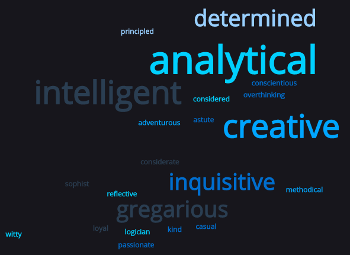

# Hey, I'm Cam 👋 

## I'm a Junior Software Developer with a background in Whisky marketing 🥃

- 🌱 I recently took a leap of faith, leaving behind a career in whisky marketing to pursue my passion for software and technology. I’m currently trying to learn everything 😅
- 🥅 2022 Goals: Secure a junior software developer at a company that shares my values. Learn more about smart contracts; maybe even Solidity if I can find enough hours in the day.
- 💡 Ideas: I believe technology has the power to reshape institutions and help democratise opportunity worldwide. I value what I don't know more than what I do.
- 🙋‍♂️ Passionate, with a heavy dose of humility.

### My journey so far:

- [x] Fullstack web app tracking group spending - Python with Flask and PostgreSQL
- [x] Fullstack, supplementary educational web app - Javascript with React and MogoDB (collaborative project)
- [ ] Java
- [ ] Solidity

### Connect with me:

  

  

---

### Languages and Tools:

 
 

---

  
:zap: GitHub Stats

  

---

## I was recently challenged to ask a variety of ex-colleagues, friends and family the following question:

### "The good, the bad and the ugly: what three words would you use to describe me?"

[instagram]: https://instagram.com/whisky_cam
[linkedin]: https://linkedin.com/in/johnstoncameron